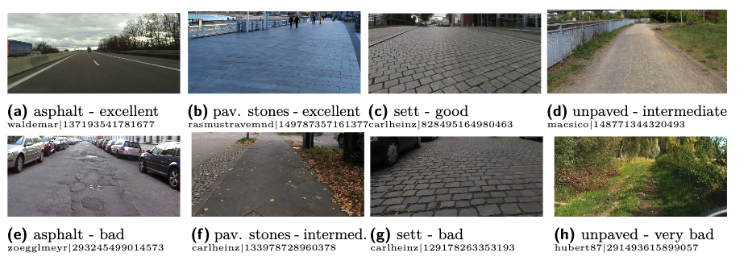

-------------------------------
-------------------------------

# Dataset: StreetSurfaceVis V1.0

-------------------------------
-------------------------------


## Dataset description:

*StreetSurfaceVis* is an image dataset containing **XXX street-level images from Germany** with labels on **road surface type and quality**. The CSV file *name* contains all image metadata and four folders contain the image files. All images are available in four different sizes, based on the image width, in 256px, 1024px, 2048px and the original size.
Image folders are named according to this image size. Image files are named based on the `mapillary_image_id`.

Please refer to this publication xxx and [this](https://github.com/SurfaceAI/dataset_creation) GitHub Repository for details on the (semi-automated) image selection process.

### Image metadata

Each CSV record contains information about one street-level image about the following attributes:

- `mapillary_image_id`: ID provided by Mapillary (see information below on Mapillary)
- `user_id`: Mapillary user ID of contributor
- `user_name`: Mapillary user name of contributor
- `captured_at`: date image was caputure
- `latitude, longitude`: location the image was taken at
- `train`: Suggestion to split train and test data. `True` for train data and `False` for test data. Test data contains data from 5 cities which are excluded in the training data.
- `surface_type`: Surface type of the road in the focal area (the center of the lower image half) of the image. Possible values: asphalt, concrete, paving_stones, sett, unpaved
- `surface_quality`: Surface quality of the road in the focal area of the image. Possible values: (1) excellent, (2) good, (3) intermediate, (4) bad, (5) very bad (see the `labeling_guide.md`document for details)


### Example images: 



### Image source:

- Images are obtained from [Mapillary]((https://www.mapillary.com/)), a crowd-sourcing plattform for street-level imagery.
- More metadata about each image can be obtained via the [Mapillary API](https://www.mapillary.com/developer/api-documentation?locale=de_DE#image) 

User-generated images are shared by Mapillary under the [CC-BY-SA](https://creativecommons.org/licenses/by-sa/4.0/) License.
For each image, the dataset contains the `mapillary_image_id` and `user_name`. 
You can access user information on the Mapillary website by https://www.mapillary.com/app/user/\<USER_NAME> 
and image information by https://www.mapillary.com/app/?focus=photo&pKey=<MAPILLARY_IMAGE_ID>

### Surface quality:

The labeling scheme for surface quality is created according to the [OpenStreetMap *smoothness* tag](https://wiki.openstreetmap.org/wiki/Key:smoothness)

| Quality Level | Usable By                        | Description                                                                                                             |
|---------------|----------------------------------|-------------------------------------------------------------------------------------------------------------------------|
| excellent     | thin_rollers<br>roller blade, skateboard | As-new asphalt or concrete, smooth paving stones with seamless connections, etc.                                         |
| good          | thin_wheels<br>racing bike      | Asphalt or concrete showing the first signs of wear, such as narrow (<1.5 cm) cracks, wider cracks filled up with tar, shallow dents in which rainwater may collect, etc. that may cause trouble for rollers but not for racing bikes. The best roads paved with bricks, sett, etc. also fall in this category. |
| intermediate  | wheels<br>city bike, sport cars, wheelchair, scooter | Asphalt and equivalent that shows signs of maintenance such as patches of repaired pavement, wider cracks (>2 cm), etc. that may cause trouble for racing bikes. The pavement may contain potholes, but these are small, shallow (<3 cm deep) and few so they are easily avoided, or the road shows damage due to subsidence (depressions of a scale >50 cm) or heavy traffic (shallow ruts in asphalt caused by trucks in summer). The surface quality starts to affect the speed of most passenger cars, so they will slow down to make the ride more comfortable. The best unpaved but compacted roads fall in this category. |
| bad           | robust_wheels<br>trekking bike, normal cars, rickshaw | Heavily damaged paved roads that badly need maintenance: many potholes, some of them quite deep. The average speed of cars is less than 50% of what it would be on a smooth road. However, it isn’t so rough that ground clearance becomes a problem. |
| very Bad      | high_clearance<br>car with high clearance, light-duty off-roads vehicles | Unpaved roads with potholes and ruts, but still passable with an average SUV with a ground clearance of at least 18 cm. |


### Instances per class:

Total number of images: xxx


|                 | excellent | good | intermediate | bad | very bad |
|-----------------|-----------|------|--------------|-----|----------|
| asphalt         |           |      |              |     |          |
| concrete        |           |      |              |     |          |
| paving stones   |           |      |              |     |          |
| sett            |           |      |              |     |          |
| unpaved         |           |      |              |     |          |


### Inter-rater-reliablility

Three annotators labeled the dataset, such that each image was annotated by one person. When in doubt, annotators could have their labels revised by a peer.
1800 images were annotated by all three annotators, resulting in a *Krippendorff's alpha* of 0.96 for surface type and 0.74 for surface quality.

### Recommended image preprocessing

As the focal road located in the bottom center of the street-level image is labeled, it is recommended to crop images to their lower and middle half prior using for classification tasks.

This is an exemplary code for recommended image preprocessing in `python`:

```python
img = Image.open(image_path)
width, height = img.size
img_cropped = img.crop((0.25 * width, 0.5 * height, 0.75 * width, height))
```


## License

[CC-BY-SA](https://creativecommons.org/licenses/by-sa/4.0/)

## Citation

If you use this dataset, please cite as: 

    TODO

-----------------------------------------------------------------------------------------------------------------------------------------------------------
-----------------------------------------------------------------------------------------------------------------------------------------------------------

This is part of the SurfaceAI project at the University of Applied Sciences, HTW Berlin.
- Prof. Dr. Helena Mihaljević
- Alexandra Kapp
- Edith Hoffmann
- Esther Weigmann

Contact: surface-ai@htw-berlin.de

https://surfaceai.github.io/surfaceai/

**Funding**: SurfaceAI is a mFund project funded by the Federal Ministry for Digital and Transportation Germany.


