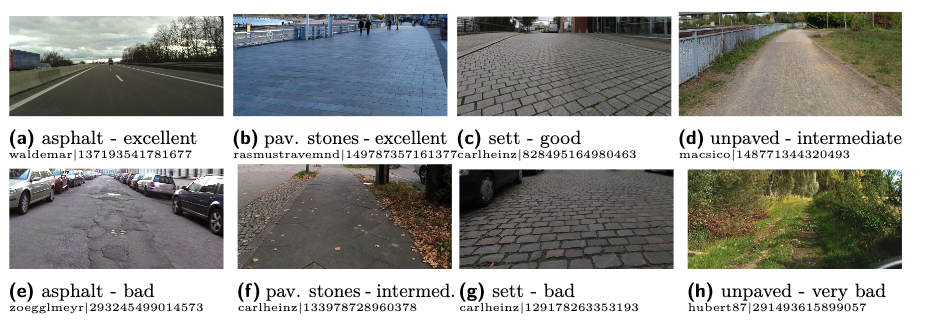

-------------------------------
-------------------------------

# Dataset: StreetSurfaceVis V1.0

-------------------------------
-------------------------------


*StreetSurfaceVis* is an image dataset containing **9,122 street-level images from Germany** with labels on **road surface type and quality**. The CSV file `streetSurfaceVis_v1_0.csv` contains all image metadata. All images are available in four different sizes, based on the image width, in 256px, 1024px, 2048px and the original size.
Folders containing the images are named according to the respective image size. Image files are named based on the `mapillary_image_id`.


## Example images 



## Image metadata

Each CSV record contains information about one street-level image with the following attributes:

- `mapillary_image_id`: ID provided by Mapillary (see information below on Mapillary)
- `user_id`: Mapillary user ID of contributor
- `user_name`: Mapillary user name of contributor
- `captured_at`: timestamp, capture time of image
- `longitude`, `latitude`: location the image was captured at
- `train`: Suggestion to split train and test data. `True` for train data and `False` for test data. Test data contains data from 5 cities which are excluded in the training data.
- `surface_type`: Surface type of the road in the focal area (the center of the lower image half) of the image. Possible values: asphalt, concrete, paving_stones, sett, unpaved
- `surface_quality`: Surface quality of the road in the focal area of the image. Possible values: (1) excellent, (2) good, (3) intermediate, (4) bad, (5) very bad (see the attached **Labling Guide document** for details)


## Image source

Images are obtained from [**Mapillary**]((https://www.mapillary.com/)) [1], a crowd-sourcing plattform for street-level imagery.
More metadata about each image can be obtained via the [**Mapillary API**](https://www.mapillary.com/developer/api-documentation) [2].
User-generated images are shared by Mapillary under the [CC-BY-SA](https://creativecommons.org/licenses/by-sa/4.0/) License [3].

For each image, the dataset contains the `mapillary_image_id` and `user_name`: You can access user information on the Mapillary website by `https://www.mapillary.com/app/user/<USER_NAME>` and image information by `https://www.mapillary.com/app/?focus=photo&pKey=<MAPILLARY_IMAGE_ID>`

If you use the provided images, please adhere to the [**terms of use of Mapillary**](https://www.mapillary.com/terms) [4].


[1] https://www.mapillary.com/

[2] https://www.mapillary.com/developer/api-documentation

[3] https://creativecommons.org/licenses/by-sa/4.0/

[4] https://www.mapillary.com/terms


## Instances per class

Total number of images: 9,122 


|                 | excellent | good | intermediate | bad | very bad |
|-----------------|-----------|------|--------------|-----|----------|
| asphalt         |    971    | 1696 |      821     | 246 |          |
| concrete        |    314    |  350 |      250     |  58 |          |
| paving stones   |    385    | 1063 |      519     |  70 |          |
| sett            |           |  129 |      694     | 540 |          |
| unpaved         |           |      |      326     | 387 |    303   |


For modeling, we recommend using a train-test split where the test data includes geospatially distinct areas, thereby ensuring the model's ability to generalize to unseen regions is tested. We propose five cities varying in population size and from different regions in Germany for testing - images are tagged accordingly.

Number of test images (train-test split): 776


## Inter-rater-reliablility

Three annotators labeled the dataset, such that each image was annotated by one person. Annotators were encouraged to consult each other for a second opinion when uncertain.
1,800 images were annotated by all three annotators, resulting in a *Krippendorff's alpha* of 0.96 for surface type and 0.74 for surface quality.


## Recommended image preprocessing

As the focal road located in the bottom center of the street-level image is labeled, it is recommended to crop images to their lower and middle half prior using for classification tasks.

This is an exemplary code for recommended image preprocessing in `Python`:

```python
    from PIL import Image

    img = Image.open(image_path)
    width, height = img.size
    img_cropped = img.crop((0.25 * width, 0.5 * height, 0.75 * width, height))
```


## License

[**CC-BY-SA**](https://creativecommons.org/licenses/by-sa/4.0/) [5]

[5] https://creativecommons.org/licenses/by-sa/4.0/

-----------------------------------------------------------------------------------------------------------------------------------------------------------
-----------------------------------------------------------------------------------------------------------------------------------------------------------

This is part of the SurfaceAI project at the University of Applied Sciences, HTW Berlin.

- Prof. Dr. Helena Mihajlević
- Alexandra Kapp
- Edith Hoffmann
- Esther Weigmann

Contact: [surface-ai@htw-berlin.de](surface-ai@htw-berlin.de)

[https://surfaceai.github.io/surfaceai/](https://surfaceai.github.io/surfaceai/)

**Funding**: SurfaceAI is a mFund project funded by the Federal Ministry for Digital and Transportation Germany.


