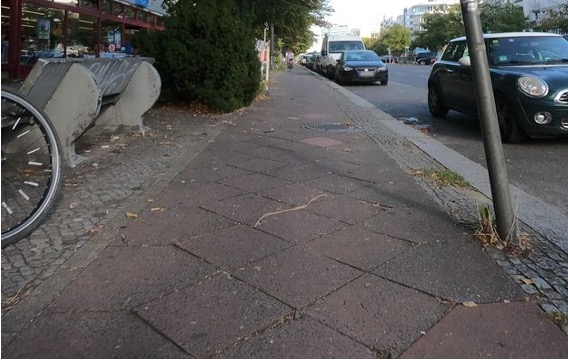

# Labeling guide

Descriptions are adapted from the [OSM Wiki for `smoothness`](https://wiki.openstreetmap.org/wiki/Key:smoothness).
## Asphalt

| Quality     | Description                                                                                                                                                                                                                                                                                    |                                                        |
|-------------|------------------------------------------------------------------------------------------------------------------------------------------------------------------------------------------------------------------------------------------------------------------------------------------------|-----------------------------------------------------------------------|
| excellent   | As good as new asphalt, on which a skateboard or rollerblades will have no problem.                                                                                                                                                                                                             |                     |
| good        | Asphalt showing the first signs of wear, such as narrow, smaller than 1.5 cm cracks, or wider cracks filled up with tar, shallow dents in which rainwater may collect, which may cause trouble for rollerblades but not for racing bikes.                                                         |                          |
| intermediate| Asphalt roads that shows signs of maintenance, such as patches of repaired surface, wider cracks larger than 2cm. Asphalt sidewalks may contain potholes, but these are small, shallow (<3cm deep) and can be easily avoided. Asphalt driving lanes shows damage due to subsidence (depressions of a scale >50 cm) or heavy traffic (shallow ruts in asphalt caused by trucks in summer). This means that the road can be used by normal city bikes, wheelchairs and sports cars, but not by a racing bike. |                  |
| bad         | Damaged asphalt roads that show clear signs of maintenance: This might include potholes, some of them quite deep, which might decrease the average speed of cars. However, it isn’t so rough that ground clearance becomes a problem. Meaning that the street causes trouble to normal city bike but not a trekking bike and a car. |                           |

## Concrete

| Quality    | Description                                                                                                                                                                                                                                                                                   |                                                           |
|------------|-----------------------------------------------------------------------------------------------------------------------------------------------------------------------------------------------------------------------------------------------------------------------------------------------|--------------------------------------------------------------------------|
| excellent  | As good as new concrete, on which a skateboard or rollerblades will have no problem.                                                                                                                                                                                                          |                       |
| good       | Concrete road showing the first signs of wear, such as narrow, smaller than 1.5 cm cracks, or wider cracks filled up with tar, shallow dents in which rainwater may collect, which may cause trouble for rollerblades but not for racing bikes.                                                  |                            |
| intermediate | Concrete roads that shows signs of maintenance, such as patches of repaired surface, wider cracks larger than 2cm. Concrete sidewalks may contain potholes, but these are small, shallow (<3cm deep) and can be easily avoided. Concrete driving lanes show damage due to subsidence (depressions of a scale >50 cm) or heavy traffic (shallow ruts in concrete caused by trucks in summer). This means that the road can be used by normal city bikes, wheelchairs and sports cars, but not by a racing bike. |                   |
| bad        | Heavily damaged concrete roads that badly need maintenance: many potholes, some of them quite deep. The average speed of cars is less than 50% of what it would be on a smooth road. However, it isn’t so rough that ground clearance becomes a problem. Meaning that the street causes trouble to normal city bike but not a trekking bike and a car |                            |

## Paving stones

| Quality    | Description                                                                                                                                                                                                                                                                                   |                            |
| Quality    | Description                                                                                                                                                                                                                                                                                   |                                                         |
|------------|-----------------------------------------------------------------------------------------------------------------------------------------------------------------------------------------------------------------------------------------------------------------------------------------------|------------------------------------------------------------------------|
| excellent  | Newly installed and regularly laid paving stones that show no signs of wear. Gaps may be visible, but they are small and uniform and do not significantly affect the driving experience.                                                                                                        |                |
| good       | Paving stones showing first signs of wear or newly installed stones with visible but uniform gaps between them. While still suitable for most activities, these surfaces may pose minor challenges for rollerblades and skateboards but remain navigable for racing bikes.                      |                     |
| intermediate | Characterized by paving stones exhibiting multiple signs of wear, such as shifted heights, potholes, or cracks. This grade allows for the comfortable passage of normal city bikes and standard vehicles but may prove challenging for racing bikes.                                            |             |
| bad        | Heavily uneven or damaged paving stones in dire need of maintenance, featuring significant height disparities and numerous deep potholes. While ground clearance remains sufficient for most vehicles, the surface severely impedes travel, particularly for standard city bikes.                |                      |

## Sett

| Quality    | Description                                                                                                                                                                                                                                      |                                           |
|------------|--------------------------------------------------------------------------------------------------------------------------------------------------------------------------------------------------------------------------------------------------|----------------------------------------------------------|
| good       | The best sett roads that do not show signs of wear and have small gaps between the stones. The surface might cause trouble for rollerblades but not for racing bikes.                                                                             |                |
| intermediate | Sett that shows signs of maintenance, such as shifted heights of the stones. The surfaces of the stones are not smooth and there might be slightly larger gaps between stones, such that the road can be used by normal city bikes, wheelchairs, and sports cars, but not by a racing bike. |        |
| bad        | Sett stones with large and possibly uneven gaps or damaged stones and an overall bumpy surface: The average speed of cars is less than 50% of what it would be on a smooth road. However, it isn’t so rough that ground clearance becomes a problem. Meaning that the street causes trouble to normal city bike but not a trekking bike and a car.  |                 |

## Unpaved

| Quality    | Description                                                                                                                                                                                                                                                  |                             |
|--------------|--------------------------------------------------------------------------------------------------------------------------------------------------------------------------------------------------------------------------------------------------------------|--------------------------------------------|
| intermediate | The best unpaved roads that have a compacted surface. The surface might cause trouble for rollerblades but not for a racing bikes or a wheelchair.                                                                                                              |  |
| bad          | Unpaved roads that do not have a smooth and compacted surface but ones that can still be used with a car or trekking bike but not with a city bike.                                                                                                            |               |
| very_bad     | Heavily uneven unpaved roads that badly need maintenance and may be partly overgrown with grass: The average speed of cars is less than 50% of what it would be on a smooth road. However, it isn’t so rough that ground clearance becomes a problem. Meaning that the street causes trouble to normal city bike but not a trekking bike and a car. |     |
